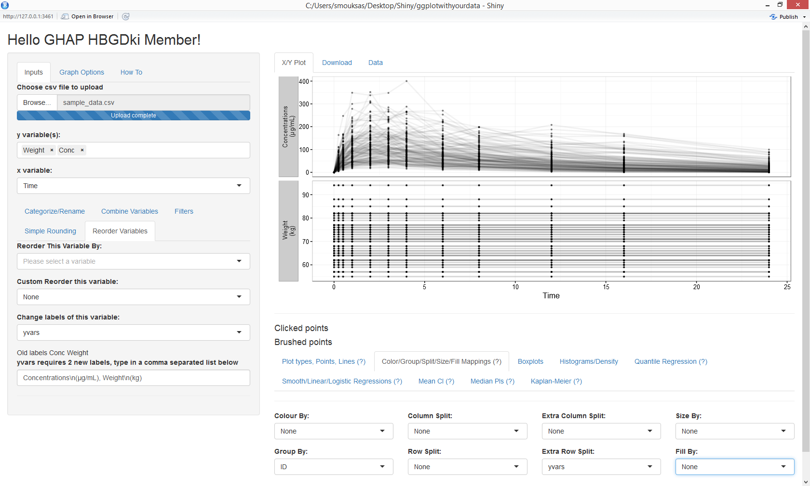
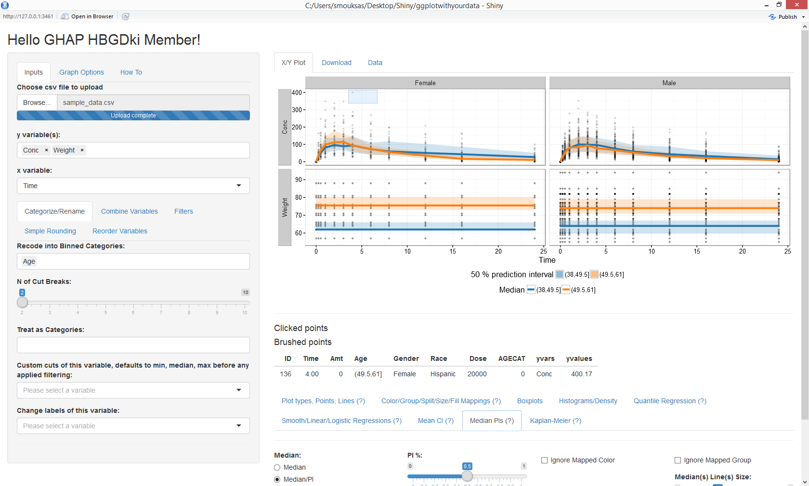
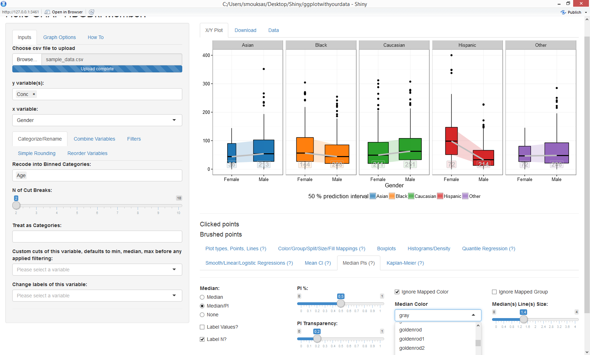
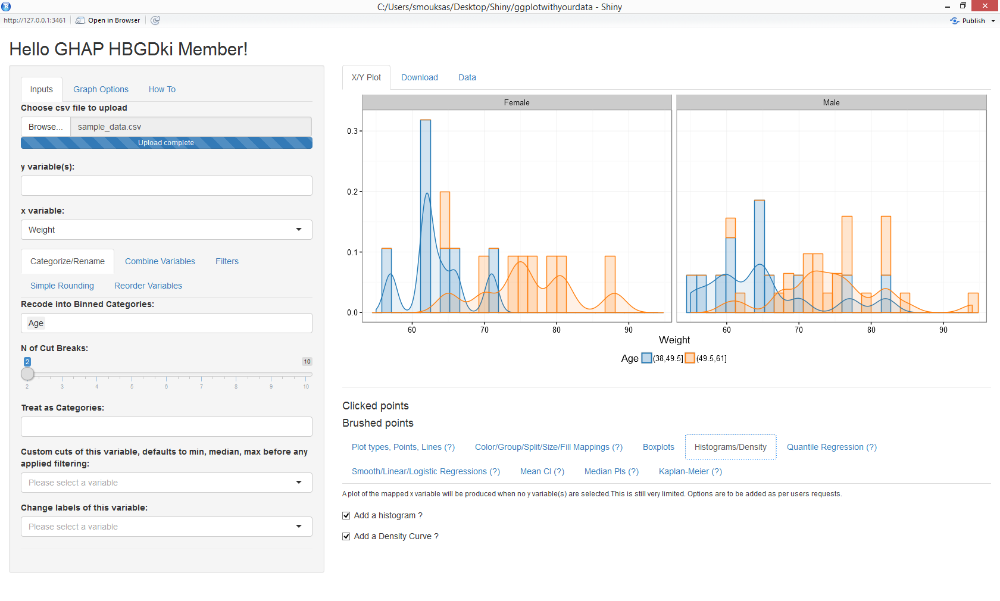

ggplotwithyourdata
========
R Shiny app as a handy inteface to ggplot2. It enables you to quickly explore your data to detect trends on the fly. You can do scatter plots, dotplots, boxplots, histograms and densities.

### CSV Data Input 
* [read.csv("youruploadeddata.csv",na.strings = c("NA","."))]

### Data Manipulations 
* Change continuous variable to be treated as categorical 
* Change continuous variable to categories with a specified number of bins or by supplying values for the bins start/end
* Up to six sequential filters for categorical and continuous variables
* Renaming and reordering of the levels of a categorical variable
* Combining two categorical variables into one
* Rounding a numerical variable to a specified number of digits

### Summary/Regression functions 
* Quantile Regression 
* Smooth/Linear/Logistic Regressions
* Mean Confidence Intervals
* Median Prediction Intervals
* Kaplan-Meier

### `ggplot2` built-in functionality
*`facet_grid` and `facet_wrap`
* Group, color, size, fill mappings
* Controlling y and x axis labels, legends and other commonly used theme options.

### Running Information
```
shiny::runGitHub('ggplotyourdata', 'HBGDki', subdir = 'shinyapp')
```









